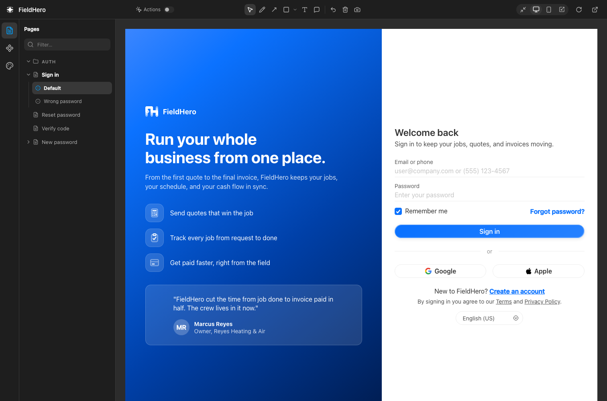

# Workbench

By Canonic. A design workbench for the screens already in your repo. Every page and preview
on one canvas, at a real device width — draw on one and hand the picture to your
agent.



It is for the HTML you are designing in: a design system's previews, a product's
screens, a set of static pages. Nothing is bundled, transpiled, or scanned for —
you list what you want to see in one file and it shows up.

## Quick start

1. Install the extension.
2. Write `workbench.yaml` at the root of your project:

   ```yaml
   name: Acme

   sections:
     - name: Pages
       icon: file-text
       items:
         - label: Sign in
           src: pages/sign-in.html
           states:
             - id: default
               label: Default
             - id: error
               label: Wrong password

     - name: Components
       icon: component
       items:
         - label: Button
           src: preview/components-button.html
   ```

3. Open the folder. **Workbench** appears in the activity bar, and opens the
   canvas.

Your pages need nothing added to them — no script tags, no imports, no folder
copied into the repo. The extension serves the workbench alongside your project
and puts what a preview needs into the pages it serves. Delete `workbench.yaml`
and every trace of this is gone.

## What you get

- **The screen list in the sidebar**, where a file tree usually goes: sections
  listed above the chosen one's screens, folders, and the states of a screen under it.
- **Page states.** One page, several versions — the empty form and the one that
  came back wrong. A state is CSS keyed off `html[data-wb-state]`, markup that
  only exists in some states, or an attribute applied in one; see
  [workbench/states.js](workbench/states.js).
- **Real widths.** Fit, desktop, mobile, or a frame you drag.
- **Markup and screenshots.** Scribble, arrows, shapes, text, comments. The
  camera downloads its JPEG; handoffs persist their image in the project's
  ignored `.canonic/.handoffs/` folder.
- **Handoff.** The screenshot is saved, the markup is cleared, and a written
  account of every mark is copied to the clipboard for any conversation.
- **Bounded diagnostics.** Browser, capture, server, and handoff failures meet
  in VS Code's session-managed **Workbench** log. Run **Workbench: Show
  Log** to inspect it; VS Code owns retention, so logs do not grow in
  the project or enter source control. Each workbench server also stops logging
  after 2 MB in one session. Records contain event metadata and errors, never
  screenshots, page HTML, or handoff prompts.
- **Actions off by default**, so clicking around a screen you're reviewing
  doesn't navigate you out of it. Turn it on to walk the real flow.
- **Implementation lenses.** The same screen as its Storybook story, on the
  dev server, on staging — one click away from the design, in the same frame,
  with the same marks over it. See below.

The full config schema, the address-bar format, and what each file does are in
[workbench/README.md](workbench/README.md).

## Implementation lenses

A design screen is one picture of a thing that also exists as code. The
workbench can show that code's picture in the design's place: declare the
implementations once, then say where each screen is in each of them.

```yaml
implementations:
  storybook:
    kind: storybook
    url: http://localhost:6006
    root: ../product/packages/ui        # where that code lives, for the handoff
  dev:
    kind: url
    base: http://localhost:3710
    root: ../product
  staging:
    kind: url
    base: https://staging.example.com

sections:
  - name: Pages
    items:
      - label: Sign in
        src: pages/sign-in.html
        states:
          - id: default
            label: Default
          - id: error
            label: Wrong password
        implementations:
          dev:                            # a map of this screen's state ids to paths…
            default: /
            error: /?error=1
          staging: /                      # …or one path for every state
        code:
          dev: packages/auth/src/pages/login

  - name: Components
    items:
      - label: Button
        src: preview/components-button.html
        implementations:
          storybook: Components/Button    # a story title, as Storybook shows it
```

A screen that declares any of them gets a **lens switcher** in the toolbar:
Design, then each implementation it has. The choice sticks as you move
between screens, like the width does; a screen without that lens shows its
design. The address carries it — `#pages/sign-in.html:error@393~staging` —
so a copied link means the implementation too.

- **Storybook** shows one story at a time, with none of Storybook's own
  chrome, and lists the title's stories in a menu beside the switcher. They
  are read from the Storybook's index, so nothing is listed twice. Where a
  story's component lives comes from the index as well.
- **A url implementation** loads directly in an iframe, just like a Storybook
  story. Typing, scrolling, selection, and sign-in happen in that page.
  Configure the app's development environment to allow embedding and its
  session to work inside the workbench. See [embedding and sign-in](workbench/README.md#embedding-and-sign-in).
  Remove legacy `render` settings; all lenses now use iframes.
- **Code pointers** resolve on this machine against each implementation's
  `root`. The `</>` button in the toolbar lists the design file and every
  implementation's code for the current screen and opens one in the editor;
  the handoff quotes their absolute paths, so the agent edits the
  implementation the picture is of.

Screenshots through a lens name the lens — `sign-in-error-staging.jpg` —
and the handoff says which implementation it shows, at what address, and
what is under each mark, read by whichever browser took the shot.

Ports, and where the product's code is on your disk, belong in
`workbench.local.yaml` beside the committed file. It is merged over
`workbench.yaml` — each implementation by name, everything else whole — and
belongs in `.gitignore`. The design lens itself never touches the network.

## Commands

| Command | Does |
| --- | --- |
| `Workbench: Open Canvas` | the canvas, in an editor tab |
| `Workbench: Open Canvas in Browser` | the same thing, in your browser |
| `Workbench: Copy Canvas URL` | the address, for a bookmark or a script |
| `Workbench: Refresh Screens` | re-read `workbench.yaml` now |

## Settings

`canonic.capture.chromePath` — an explicit Chrome, Chromium, or Edge executable
for fallback screenshots. Packaged desktop builds
take screenshots with a bundled background Electron helper. An installation
without one, or a helper that cannot unpack or start, uses Chrome for screenshots
too. Page errors and timeouts are reported through the current renderer. Leave
the setting empty to detect Chrome from its standard location when it is needed.

The screenshot helper starts with the workspace server and remains warm for
the extension's lifetime. The workbench continuously synchronizes the local
preview's live DOM, open shadow roots, form state, scrolling and annotations
into its inert mirror, and restores the latest view after a crash. A page
that hangs the helper is not replayed on its own; the workbench asks again
with a growing delay. Reloading the preview refreshes the helper's copy. On
macOS the bundle is an agent app, with no visible window or Dock icon. No VS
Code startup flags are required. Interactions stay on the native capture path;
capture flushes pending state before reading pixels. Hosted errors are reported
without switching to DOM-to-image rendering. Cross-origin iframe interaction
state cannot be copied. See the workbench README for mirror limitations.
After the initial full snapshot, the mirror sends changed node records and
properties. Cumulative patches tolerate overlapping background preparation;
a lost base revision triggers a full retry of the exact requested state.

## How it finds a project

`workbench.yaml` in an open folder is the whole test — it is both the
`workspaceContains:` activation event and the check in `workbenchRoot()`, which
also decides which folder gets served when a window holds several: the first one
that has it.

A folder without one gets no server and no Workbench view. The commands stay
registered, so running one from the palette explains itself rather than failing
as a missing command.

## Ports

3579, then 3580–3583, then whatever the OS gives. Loopback only — the server
hands out a whole project folder, and that isn't anybody else's business. The
workbench is served at `/_workbench/` on that same origin, which is what lets a
workbench read the preview's DOM and synchronize the native capture frame
without a cross-origin boundary.

---

## Working on it

The workbench itself is `workbench/`, and it ships in the `.vsix`. It is plain
HTML and script files with no build step; opening
`workbench/index.html?root=file:///path/to/a/project/` in a browser started with
`--allow-file-access-from-files` is enough to work on the tool.

| File | Job |
| --- | --- |
| `extension.js` | activation, the server's lifecycle, commands, clipboard handoff |
| `panel.js` | the canvas: one webview holding one iframe |
| `screens.js` | the Workbench view in the sidebar |
| `server.js` | the HTTP server, capture and lens endpoints, and script injection — plain node |
| `electron-capture.js` + `capture-helper/` | bundled background screenshot renderer, preparation and crash recovery |
| `simulator-stream.js` + `simulator-stream-demo/Capture.swift` | native ScreenCaptureKit and VideoToolbox Simulator stream |
| `capture-runtime.js` | verifies and unpacks the bundled runtime once into extension storage |
| `capture.js` | Chromium over a private DevTools pipe for fallback screenshots |
| `remote.js` | fetches the configured Storybook's index |
| `config.js` + `yaml.js` | reads `workbench.yaml` and `workbench.local.yaml` on this machine: absolute paths, implementation origins |
| `handoff.js` | composes the prompt an agent is handed. Pure string work |
| `workbench/` | the tool itself — see its README |

`server.js`, `remote.js`, `handoff.js`, `config.js` and `yaml.js`
never import `vscode`, so they run and are tested without an editor:

```sh
npm test                   # config parsing, prompt wording, routes, the browser driver
npm run serve -- <folder>   # the same server the extension runs, on its own
node handoff.js            # print the prompt for a sample canvas
node config.js <folder>    # what this machine resolves the config to
```

### The two halves

The workbench is one tool in two windows of the editor: the screen list in the
sidebar, the canvas in a tab. Neither talks to the other — both talk to
`extension.js`, and what travels between them is the hash the workbench's
address bar would have carried, `pages/sign-in.html:error`:

```text
sidebar  --canonic-pick-->  extension  --wb-go-->    canvas
sidebar  <--canonic-here--  extension  <--wb-here--  canvas
```

So picking a screen in the sidebar and pasting a workbench URL are the same
instruction, and following a link inside a live preview leaves the list marked
on wherever it ended up.

The list is `workbench/sidebar.html` loaded into a webview, with a `<base>`
saying where that folder is and a `<meta>` saying where the project is — a
webview's address is the editor's, so the page can work out neither by itself.
It paints in VS Code's theme colours rather than the workbench's: it is standing
where a file tree usually does, so it dresses like one.

The canvas is a webview holding one iframe rather than the built-in Simple
Browser, because only the page that owns the frame can pass a pick into it.

### Installing from source

```sh
npm ci --ignore-scripts
npm run package
code --install-extension canonic-workbench-*-0.4.0.vsix --force
```

After installing, run **Developer: Reload Window** from the Command Palette
in each open VS Code project window. Installing replaces the files on disk;
already-running extension hosts and capture helpers keep their previous code
until their window reloads. Reloading the preview or using **Refresh Screens**
does not restart the extension. This also applies to `scripts/install-workbench.mjs`.

Building requires Node 22.12 or later; the extension host still supports Node
18 or later. `npm run package` bundles pinned Electron 44.2.0 and produces a
platform-specific VSIX for the build host. `-- --target darwin-arm64` (or
`darwin-x64`, `win32-x64`, `win32-arm64`, `linux-x64`, `linux-arm64`) selects
another target. `npm run package:all` builds every target into `dist/`, one
at a time, finishing with the build host's so its runtime stays in place; name
targets or pass `--out <dir>` to narrow or redirect it.
Use native builders for release validation and signing.
The download happens at build time only. `CANONIC_ELECTRON_ZIP_DIR` can point
to a directory of official Electron ZIPs for an offline build.

The macOS runtime adds about 132 MB to the VSIX and hundreds of MB to the
installed runtime cache. Its tar archive preserves framework links that VSIX
cannot represent directly. Each archive is verified and extracted atomically
into `globalStorage/capture/<sha256>` on first activation. The first activation
therefore includes extraction; subsequent activations reuse the runtime and
remove runtimes left by earlier versions, so the cache holds one at a time.
Configure macOS signing/notarization before distributing public releases;
the local development package is not notarized. The `LSUIElement` setting must
be applied before signing. Other desktop targets and remote hosts still need
native validation; Linux hosts without a display keep the Chrome fallback.

### GitHub builds and releases

The [extension workflow](../.github/workflows/extension.yml) tests the extension
and builds all six platform VSIX files on matching GitHub-hosted runners when a
`workbench/v<version>` tag is pushed. Update `package.json` and its lockfile,
then push a matching tag (for example, `workbench/v1.0.1`). The workflow checks
the tag against the package version, attaches all six VSIX files to a GitHub
Release using stable, versionless asset names, and updates the website's links
after the release succeeds. Build files are also available as workflow artifacts
for 14 days.
These builds are unsigned; validate and sign platform
releases before treating them as production-ready.

For capture profiling, run `node packages/workbench/scripts/benchmark-capture.cjs` from
the repository root after bundling the runtime. It runs current helper sources
in an isolated temporary runtime and compares plain, CSS blur, and backdrop-blur
fixtures at mobile and desktop sizes. It reports preparation, native readback,
Retina resizing, PNG encoding, and helper round-trip time, with six on-demand
captures per case, including one after idle. Reports and PNGs remain in the
printed temporary directory; the temporary runtime is removed.

Pass `<project> <page> [width height]` to profile a particular local page.
Set `CANONIC_BENCH_FORMAT=jpeg` to benchmark the workbench's 90%-quality JPEG
output instead of PNG.
JPEG downsampling uses Electron's intermediate (`better`) resize setting;
`CANONIC_BENCH_RESIZE=best` compares the slower previous setting. Warm-up primes
pixel readback without encoding a discarded file. The Save button and handoff
complete their capture when the file is written; neither reads the saved image
back into the canvas.
Set `CANONIC_BENCH_CAPTURE=cdp` to compare Chromium's speed-optimized PNG path,
or `CANONIC_BENCH_CAPTURE=dom` for the vendored DOM renderer. These experimental
modes modify only the temporary helper. The CDP comparison attaches to that
helper, never VS Code, and scales its capture to CSS pixels. It uses a different
downsampling path, so compare the saved images as well as timings. The DOM mode
captures the minimal capture wrapper, not the complete interactive workbench.

Run `node packages/workbench/scripts/smoke-mirror.cjs` to exercise live shadow DOM,
forms, scrolling, adopted stylesheets, canvas, dialogs and popovers between two
isolated Electron renderers. It verifies that app scripts do not run in the
mirror and unchanged elements retain their identity. Optional `<project> <page>`
arguments exercise a heading and the first input inside an open shadow root in
a selected project. It saves source/mirror JPEGs and timing reports under a
temporary directory, without modifying project files. These timings separate snapshot,
background preparation and warm capture; they are not VS Code click timings.
Set `CANONIC_MIRROR_WORKBENCH=1` to exercise the complete hosted workbench Save
button, including background synchronization, an immediate property edit, the
HTTP request and disk write. This mode creates a temporary project with links
to the selected source files and its own `.canonic/.handoffs/` directory. It uses Electron
to host the workbench, so it still does not measure VS Code's webview overhead.
`CANONIC_MIRROR_SAMPLES=6` records six captures. Each reports frontend request
preparation, helper queue time, mirror preparation, readback, resizing and encoding.
Reports also include request size, changed node/property counts and whether
the request needed a full snapshot. The default fixture verifies structural
edits, reparenting, cumulative reversions and recovery of the requested revision.
`CANONIC_MIRROR_CDP=1` compares direct Chromium JPEG capture;
`CANONIC_MIRROR_DPR=1` tests a device-scale override only in the temporary receiver.
These are experiments, not production settings; confirm the reported bitmap size
before assuming a scale override removed Retina downsampling.
The `benchmark-capture.cjs` helper round trips include IPC and base64 decoding but exclude saving to disk,
HTTP readback, and contention from an active workbench. A warm benchmark does
not establish which path an installed workbench used during a slow capture.
The built-in temporary fixtures also report one HTTP capture-and-save round trip
per case, including disk saving. Selected projects are never written to by this
benchmark.
Use `CANONIC_BENCH_SAMPLES=1` for a single slow-page sample. DOM runs include
cloning, font embedding, asset embedding, rasterization, and encoding timings.
`CANONIC_BENCH_DOM_STYLES=resolved` experiments with omitting custom properties
from the cloned styles; it does not change the workbench's production renderer.

For a native smoke check, run `npm run bundle-capture`, then
`node scripts/smoke-capture.cjs`. It uses a temporary fixture and checks warm
capture reuse, reloads, resizing, implementation handoffs, Dock visibility,
and crash recovery. Ordinary `npm test` needs no desktop or Electron process.

`node scripts/smoke-lenses.cjs` uses an installed Chrome with temporary app and
Storybook fixtures to check native iframe input, sign-in, session persistence
across reloads and lens changes, and viewport resizing.

Cursor, Windsurf and the other VS Code forks read their own extensions folder —
`~/.cursor/extensions`, and so on — and the same command works against it.

## Licence

MIT. `workbench/modern-screenshot.js` is vendored from
[modern-screenshot](https://github.com/qq15725/modern-screenshot) (MIT, ©
qq15725).

The bundled Electron runtime includes its MIT license and Chromium's third-party
notices in `capture-runtime/runtime.tar.gz`, preserved in the extracted cache.
